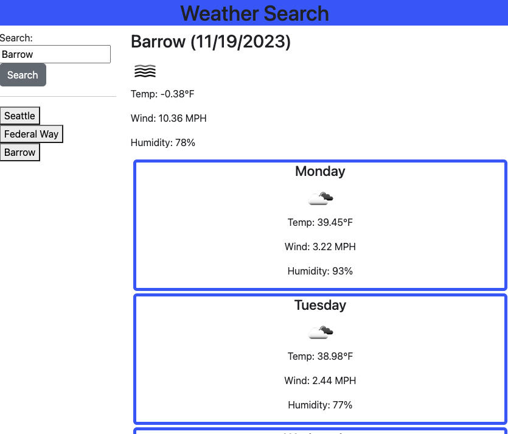

# Weather Dashboard Trip Planner

## Description
Program to plan a trip based on the upcoming local weather of searched cities. The motivation for the program is to help plan for future trips based on the current weather and the next 5 day forecast. Through the program I learned how to use API calls. This program also uses local storage and bootstrap.

## Usage

The user will enter a city name in the input search bar and click the search button. The forecast will be displayed on screen. The searched cities will also add a button to the screen if it is a unique search that has not been saved to local storage.

Diployed URL: https://ahgeak.github.io/weather-dashboard-trip-planner/
GitHub Repo URL: https://github.com/ahgeak/weather-dashboard-trip-planner

    

## Credits

I used documentation from the mdn website at: https://developer.mozilla.org/en-US/

I reviewed lessons and practice exercises on W3Shools at: https://www.w3schools.com/

I read forums on StackOverFlow at: https://stackoverflow.com/

I attend a tutoring session to discuss API calls and the structure of my functions.

## License

This project users an MIT liscene.
